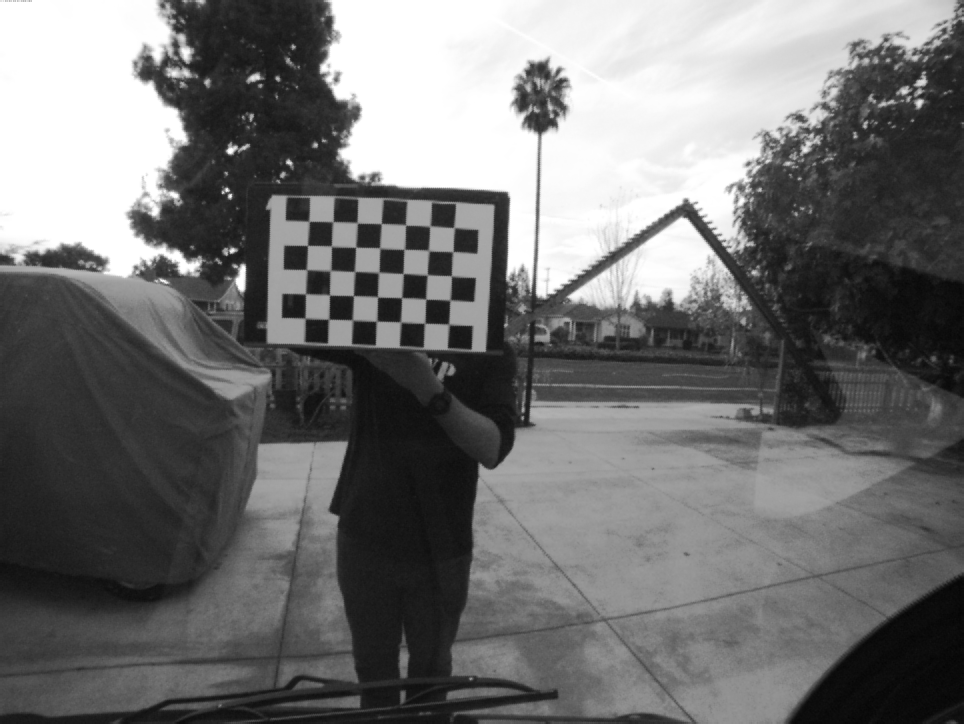
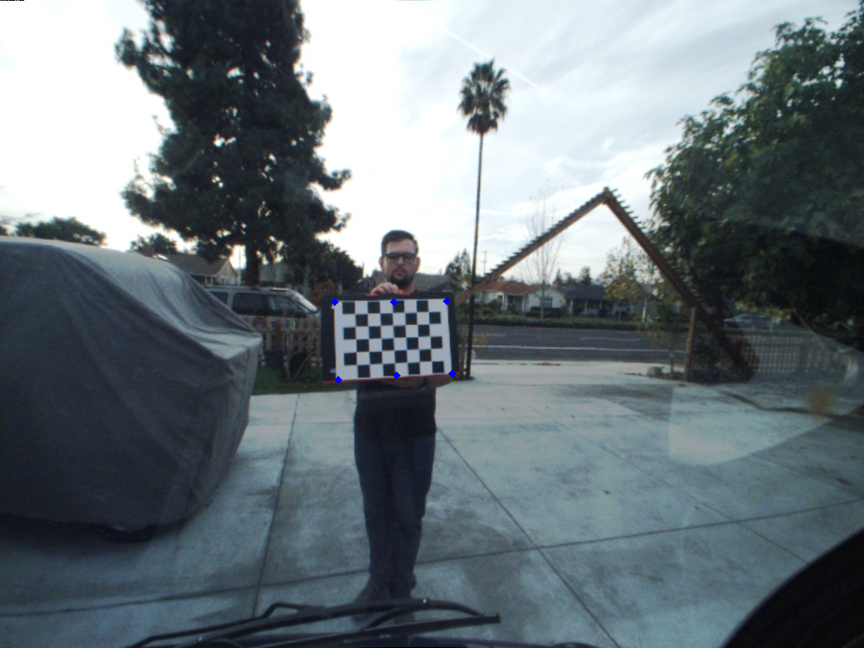
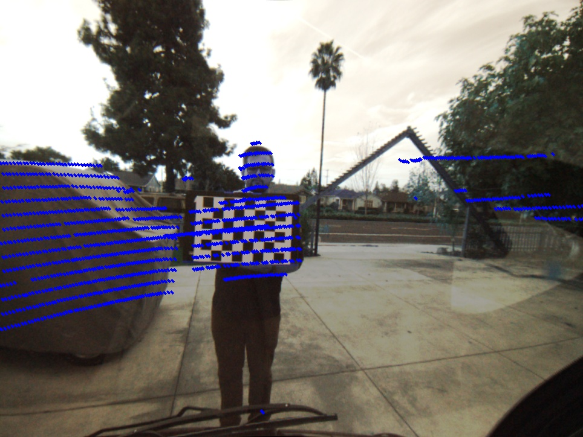
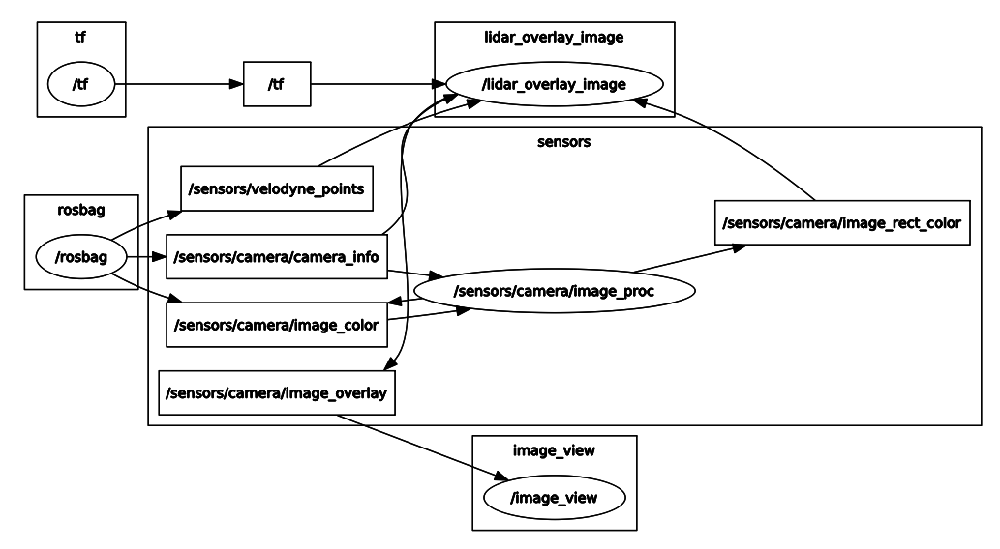

# Lidar-Camera-Calibration in ROS

1. Install ROS indigo for Ubuntu 14.04

2. Download .bag file 

3. Start roscore 

4. To see the contents of the bag:
```shell
  $ rosbag info 2016-11-22-14-32-13_test.bag 
```

5. Understanding ROS message types in the bag:
```shell
  rosmsg show sensor_msgs/PointCloud2
  rosmsg show sensor_msgs/Image
  rosmsg show sensor_msgs/CameraInfo
```

6. Script `read_bag.py` to see the values in the rosbag

7. To publish the topics in the bag, run in a new terminal:
```shell
  $ rosbag play 2016-11-22-14-32-13_test.bag
```

  To see published topics:
```shell
  $ rostopic list -v
```

8. To export images from rosbag file, ran the export.launch script
```shell
  $ roslaunch export.launch
```
  It stores images in .ros folder in home directory

9. To see the input video stream from the bag file:
```shell
  $ rosrun image_view image_view image:=/sensors/camera/image_color
```
Now, we know the contents of the ros-bag.

10. A ROS package was created to store the entire project.


**Reference:** 
http://wiki.ros.org/ROS/Tutorials 

http://wiki.ros.org/rosbag/Cookbook

http://wiki.ros.org/roslaunch/XML/node


# TASK 1: Camera Calibration for Image Rectification

1. Rosbag file is played in one terminal 

2. Publishing Camera Calibration data with bag file using camera_calibration package:
```shell
  $ rosrun camera_calibration cameracalibrator.py --size=7x5 --square=0.050 image:=/sensors/camera/image_color camera:=/sensors/camera/camera_info  --no-service-check
```
**Note:** --no-service-check added to not wait for `/sensors/camera/camera_info/set_camera_info` 
 

**OUTPUT**
Stored in ost.yaml file, udpated camera calibration matrices

```yaml
image_width: 964
image_height: 724
camera_name: narrow_stereo
camera_matrix K:
  rows: 3
  cols: 3
  data: [481.228482, 0.000000, 456.782531, 0.000000, 481.158298, 364.412635, 0.000000, 0.000000, 1.000000]
distortion_model : plumb_bob
distortion_coefficients D:
  rows: 1
  cols: 5
  data: [-0.195875, 0.065588, 0.003400, 0.000218, 0.000000]
rectification_matrix R:
  rows: 3
  cols: 3
  data: [1.000000, 0.000000, 0.000000, 0.000000, 1.000000, 0.000000, 0.000000, 0.000000, 1.000000]
projection_matrix P:
  rows: 3
  cols: 4
  data: [422.024750, 0.000000, 460.332694, 0.000000, 0.000000, 429.271149, 368.531509, 0.000000, 0.000000, 0.000000, 1.000000, 0.000000]
```

3. Saved Images in the images folder
Reference: http://wiki.ros.org/camera_calibration

Note: Camera Calibration matrices can also be calculated using opencv apis, once the images are collected from bag file using export.launch script.

4. For image rectification, camera calibration matrices info needs to be added to the input bag file. Using ros bag_tools `change_camera_info.py`, create a new output ros bag with updated calibration matrices.

```shell
$ rosrun bag_tools change_camera_info.py ../2016-11-22-14-32-13_test_orig.bag ../2016-11-22-14-32-13_test_cameracalibrated_out.bag /sensors/camera/camera_info=../config/ost.yaml
```

5. Checked using `read_bag.py` script that the values are updated.

6. To rectify images, image_proc is used. The `image_proc_view.launch` file is used to read the calibrated bag file and rectify the stream

# Explanation:

image_proc subscribes to image_color and camera_info and publishes image_rect_color

```xml
  <node name="cam_image_proc" pkg="image_proc" type="image_proc" respawn="false" ns="/sensors/camera">
  </node>
```

To check if image proc is publishing image_rect_color:

```shell
$ rostopic info /sensors/camera/image_rect_color
Type: sensor_msgs/Image

Publishers: 
 * /sensors/camera/cam_image_proc 

Subscribers: 
 * /extract_rect_image 
```
image_view subscribes to image_rect_color and extracts the rectified images from the stream
```xml
  <node name="extract_rect_image" pkg="image_view" type="extract_images" respawn="false" required="true" output="screen" cwd="ROS_HOME">
       <remap from="image" to="/sensors/camera/image_rect_color"/>
  </node>
```
image_view stores file in home directory in .ros folder, few randomly chosen rectified images were stored in images directory, as it creates a lot of images for the whole bag file. Once such rectified image is shown below:



# TASK 2: Lidar Camera Rotation + Translation Calibration

1. To find the 6DoF between Lidar and Camera, 2D-3D point correspondences methods are researched online.
 One such reference: `https://arxiv.org/pdf/1705.09785.pdf`

2. The initial point set corresponding to Lidar and Camera is calculated in following steps:

  a. rviz is used to run the input rosbag file with fixed frame set to velodyne. The config is saved as `visualize_bags.rviz`

  b.  The `visualize.launch` file is used to start rviz with image_view node, to pause and collect points from lidar point cloud and image

  c. So when a good correspondance between the point cloud and the image is seen, a frame is saved using image_view
  and the corresponding lidar point selected is published using rviz:

  ```shell
    $ rostopic echo /clicked_point
  ```
  One such clicked point is :

  ```shell

    header: 
      seq: 1
      stamp: 
        secs: 1479853956
        nsecs: 650794413
      frame_id: velodyne
    point: 
      x: 1.83453130722
      y: 0.055240329355
      z: -0.0346876457334

  ```

  d. The corresponding point from image frame saved using image_view is collected using the `get_image_points.py`

  ```shell
  (361, 334)
  ```

  e. Six such points were collected between Lidar and Camera on the checker board.
      - Four points on the four corners of checker board and 2 points in the middle of the top and bottom row of checker board.



3. Next step is to use these points to minimize the error to solve the `equation 1` described in the paper `https://arxiv.org/pdf/1705.09785.pdf` using Sequential Least SQuares Programming (SLSQP) from scipy for constrained optimization
  - `lidar3D_camera2D_points.py` file is used to calculate the transformation vector between camera and velodyne frame of references

  - the constraints are defined in `lidar_image_calibration_data.json` file along with the input points, it limits the translation between the corresponding points to be between +/- 4 meters and rotations to be a maximum of 360 degrees(2 pi)

  - `calibrate-camera-lidar.launch` is used to lauch the script `lidar3D_camera2D_points.py`

  - Optimization techniques to get to global minima was researched online

  - Once the final state vector or static transform t+R is found, as shown below, it is used in the next step to create the lidar image overlay 


```shell
Final static transform(tx, ty, tz, Ry, Rp, Rr):
[-0.211852   -0.09627462 -0.30093704  3.70629347  4.77717425  4.05932338]

```

## Lidar Image Overlay:

1. The `lidar_overlay_image.py` script is used to generate the output image desired.



2. The script subsribes to the nodes that it needs information from:
  - input calibrated camera info /sensors/camera/camera_info
  - input rectified image from /sensors/camera/image_rect_color
  - input point cloud data from /sensors/velodyne_points
  - transform tf calculated in the previous step /world/velodyne

  And it publishes -
  - output lidar point overlaid image /sensors/camera/image_overlay

3. The script has callbacks defined for each of the subscribe methods (except tf.TransformListener()) 
  - camera_callback() listens to the camera_info for the calibrated rosbag
  - tf.TransformListener() listens to the world to velodyne transform
  - velodyne_callback() listens to the PointCloud2 for velodyne points, the points are extracted using struct.unpack() in python
  - image_callback() listens to the input rectified image. It uses static tranform and velodyne frame data to calculate the rotated point in the camera frame, which in turn uses PinholeCameraModel to convert all the 3D rotated points in one frame to 2D - uv points. These points on the ros converted cv_image is then overlaid with lines to get the desired output.
  Tutorials from [Indigo API tf](http://docs.ros.org/indigo/api/tf/html/python/tf_python.html), [Indigo API transformations](http://docs.ros.org/jade/api/tf/html/python/transformations.html) 

  - image_callback() then also publishes this lidar point overlaid output, which the image_view node listens to show the video

  The output video viewed from image_view node seems laggy, due to too much processing. Some of it can be reduced by removing the image_proc node and instead creating a rectified rosbag and using it as input to the `task2_image_overlay.launch` . The synchronization can definitely be further worked upon to improve.

4. For debugging purposes, the rqt_graph and view_frames shown below was used to understand the nodes connectivity and transform 

```shell
$ rosrun tf view_frames
```



